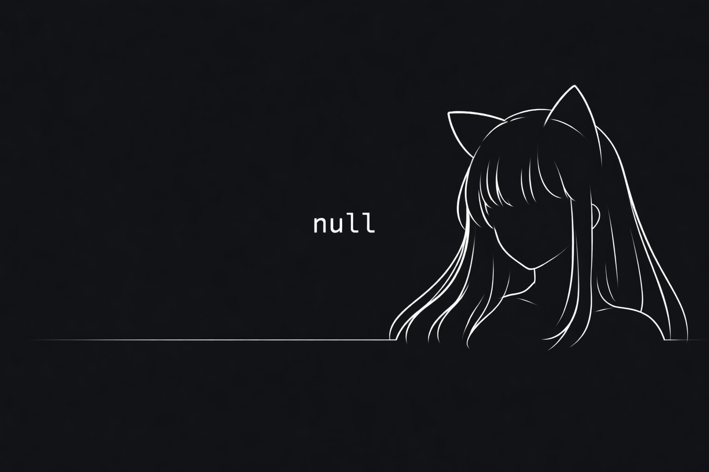

<p align="center">
  
</p>

<div align="center">

# `z7gvt9mys9-dev`

</div>

## Stack


---

## GitHub Stats

<div align="center">
  <!-- Streak -->
  

</div>

---

## System Status

```bash
> status: online
> focus: building
> mode: silent
```


